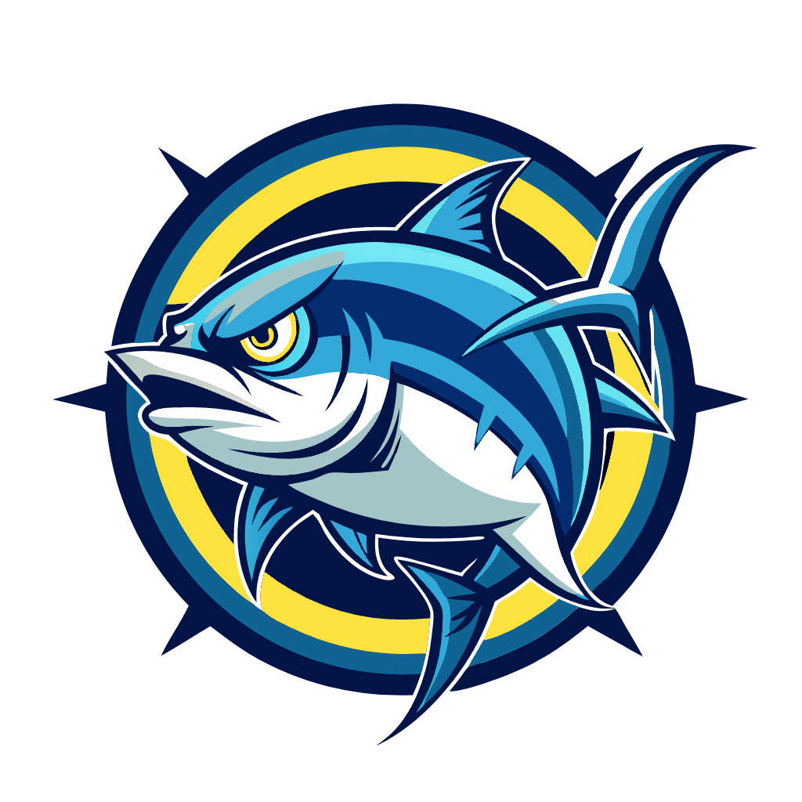

<div align="center">
  

  ***Fishing Game using Dojo Engine***
</div>

# Tonatuna: A Dojo Gamejame Project

Tonatuna is a fully on-chain PvP fishing game.

## Running Locally

#### Terminal one
```bash
# Build contract
sozo build

# Test
sozo test
```

#### Terminal two
```bash
# Run client
cd client
pnpm install
pnpm dev
```

## Option: Running Katana locally

You have to modify `dojo_dev.toml`. And check `rpc_url` and addresses.

```bash
katana --disable--fee --allowed-origins "*"
```

```bash
sozo build
sozo migrate apply
```

Then, you can test locally
```bash
source ./scripts/register_player.sh
source ./scripts/test_move.sh
```

---

## Contribution

Exploration project.

Happy coding!
